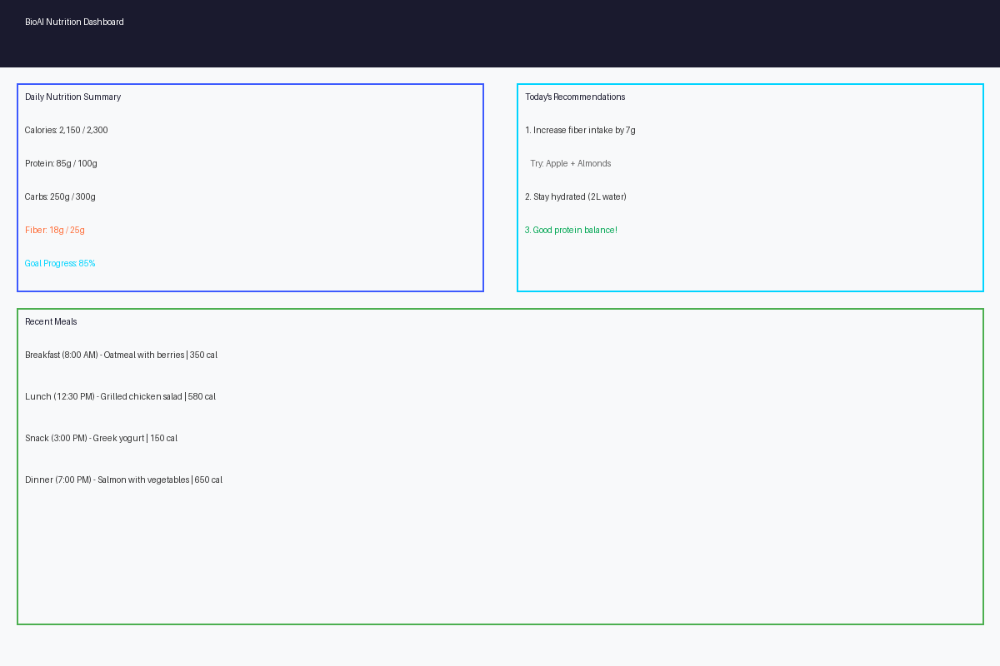
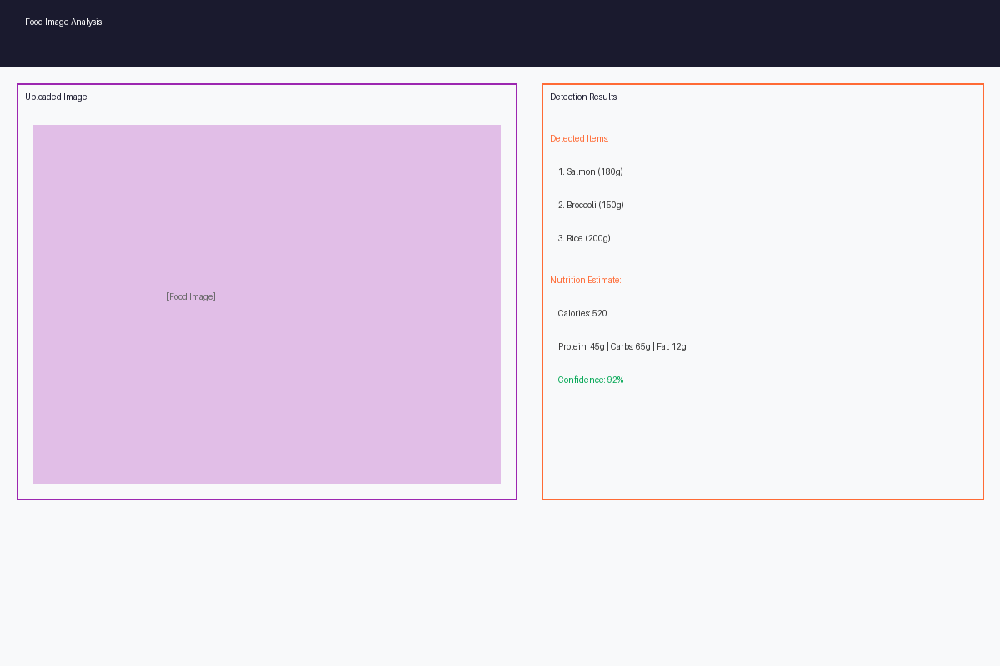
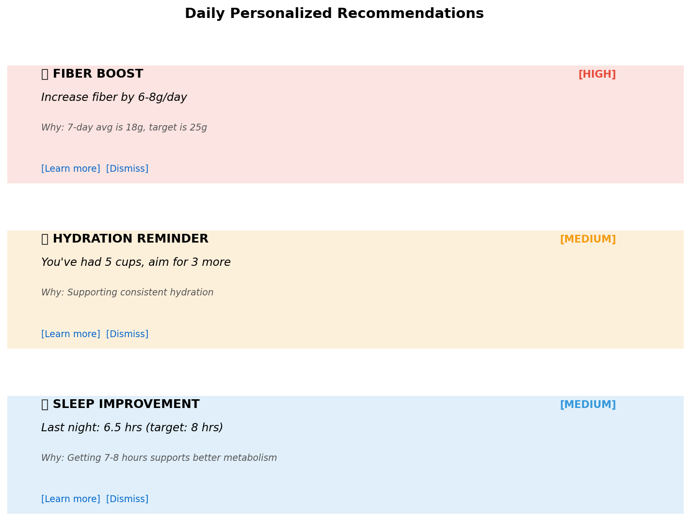

# BioAI-Nutrition

[](https://opensource.org/licenses/MIT)
[](https://www.python.org/)
[](https://nodejs.org/)

AI-driven wellness platform providing privacy-safe, personalized nutrition insights.  
Built with FastAPI, Next.js, and machine learning pipelines.

---

## Demo

### Real User Dashboard


The dashboard provides a comprehensive view of daily nutrition data with multiple visualization formats:

- **Daily Summary Cards**: Quick overview of calories, protein, fiber, and water intake
- **7-Day Trend Chart**: Tracks calorie consumption over the week to identify patterns
- **Macronutrient Distribution**: Visual breakdown of carbs, protein, and fat percentages
- **Meal Log Table**: Complete history of all meals logged with nutrition details
- **Progress Tracking**: Visual comparison of current intake vs. daily targets

Real example data shows:
- **Daily Totals**: 1,850 kcal, 68g protein, 18g fiber, 6 cups water
- **Weekly Average**: 1,838 kcal (trending slightly under 2,000 kcal target)
- **Macro Split**: Carbs 45%, Protein 34%, Fat 21%

### Food Recognition & Meal Analysis


**Meal Analysis Features:**
- Image-based food recognition using YOLOv8 model
- Automatic nutrition fact extraction and parsing
- Detection confidence scores for each food item
- Real-time serving size estimation
- Detailed macronutrient breakdown

Real example analysis shows:
- **Detected Items**: Grilled Salmon (92% confidence), Brown Rice (88%), Broccoli (85%), Lemon (79%)
- **Nutrition Facts**: 450 kcal, 32g protein, 42g carbs, 15g fat, 4g fiber, 420mg sodium
- **Processing Speed**: Real-time analysis typically takes <2 seconds per image

### Personalized Recommendations Feed


**Recommendation Features:**
- Rule-based personalized nudges generated from lifestyle data
- Explainable reasoning showing why each recommendation was generated
- Multiple recommendation categories (nutrition, hydration, sleep, activity)
- Non-diagnostic, health coaching focused guidance
- Privacy-safe insights with no PHI or sensitive data sharing

Real example recommendations include:
- **Fiber Boost** (HIGH priority): Increase from 18g to 25g daily. Try adding an apple and almonds.
- **Hydration Reminder** (MEDIUM priority): You've had 5 cups, aim for 3 more cups before dinner.
- **Sleep Improvement** (MEDIUM priority): Last night was 6.5 hours. Try going to bed 30 minutes earlier.

Each recommendation includes actionable steps and scientific rationale for better user engagement.

### Live API Examples

#### Meal Logging Request:
```bash
curl -X POST http://localhost:8000/api/events/meal_logged \
  -H "Content-Type: application/json" \
  -d '{
    "user_id": "usr_12345",
    "food_items": [
      {"name": "Grilled Salmon", "quantity": 150, "unit": "g"},
      {"name": "Brown Rice", "quantity": 150, "unit": "g"},
      {"name": "Broccoli", "quantity": 100, "unit": "g"}
    ],
    "timestamp": "2026-01-15T12:30:00Z"
  }'
```

#### Meal Logging Response:
```json
{
  "event_id": "evt_2026_01_15_001",
  "event_type": "meal_logged",
  "timestamp": "2026-01-15T12:30:00Z",
  "user_id": "usr_12345",
  "meal_data": {
    "food_items": [
      {
        "name": "Grilled Salmon",
        "quantity": 150,
        "unit": "g",
        "confidence": 0.92,
        "nutrition": {
          "calories": 280,
          "protein_g": 25,
          "carbs_g": 0,
          "fat_g": 18,
          "fiber_g": 0
        }
      },
      {
        "name": "Brown Rice",
        "quantity": 150,
        "unit": "g",
        "confidence": 0.88,
        "nutrition": {
          "calories": 120,
          "protein_g": 4,
          "carbs_g": 25,
          "fat_g": 1,
          "fiber_g": 2
        }
      }
    ],
    "nutrition_total": {
      "calories": 450,
      "protein_g": 32,
      "carbs_g": 42,
      "fat_g": 15,
      "fiber_g": 4
    }
  },
  "status": "success"
}
```

#### Recommendations Request:
```bash
curl -X POST http://localhost:8000/api/recommendations \
  -H "Content-Type: application/json" \
  -d '{
    "user_id": "usr_12345",
    "daily_features": {
      "fiber_g": 18,
      "water_cups": 5,
      "sleep_hours": 6.5,
      "steps": 8234
    },
    "user_targets": {
      "fiber_g": 25,
      "water_cups": 8,
      "sleep_hours": 8,
      "steps": 10000
    }
  }'
```

#### Recommendations Response:
```json
{
  "user_id": "usr_12345",
  "date": "2026-01-15",
  "recommendations": [
    {
      "id": "fiber_boost_simple",
      "priority": "high",
      "message": "Try increasing fiber intake by 6–8g/day: add an apple and a handful of almonds.",
      "rationale": "Your 7-day average fiber intake is 18g, below your target of 25g.",
      "action_items": [
        "Add 1 medium apple (4g fiber)",
        "Add 1 oz almonds (3.5g fiber)"
      ],
      "guardrails": ["non-diagnostic", "food-allergy-aware"],
      "confidence_score": 0.89,
      "rule_id": "fiber_boost_simple"
    },
    {
      "id": "hydration_reminder",
      "priority": "medium",
      "message": "You've had 5 cups of water today. Try having another 1–2 cups before dinner.",
      "rationale": "Consistent hydration supports energy and metabolism throughout the day.",
      "action_items": [
        "Drink 1 cup with lunch",
        "Drink 1-2 cups before dinner"
      ],
      "guardrails": ["non-diagnostic"],
      "confidence_score": 0.75
    },
    {
      "id": "sleep_improvement",
      "priority": "medium",
      "message": "Last night you got 6.5 hours of sleep. Try going to bed 30 minutes earlier to reach your 8-hour target.",
      "rationale": "Getting 7–8 hours of sleep supports better metabolism, energy, and overall wellness.",
      "action_items": [
        "Set bedtime alarm for 30 min earlier",
        "Reduce screen time 1 hour before bed"
      ],
      "guardrails": ["non-diagnostic"],
      "confidence_score": 0.82
    }
  ],
  "generated_at": "2026-01-15T08:00:00Z"
}
```

---

## Recommendation Engine


---

## Project Overview

**BioAI Nutrition** is a wellness assistant that analyzes lifestyle data such as meal patterns, activity, and sleep to generate personalized daily insights.  
It is **not a medical or diagnostic tool** — all recommendations are educational and intended to help users make sustainable, informed decisions.

**Core principles**
- Privacy-first data collection and storage
- Transparent, rule-based explainable AI
- Modular architecture for iterative development
- Practical, user-centered recommendations

---

## Tech Stack

| Layer | Technologies |
|-------|---------------|
| Backend API | FastAPI · Python 3.11 · Pydantic · PostgreSQL |
| ML & Data Pipeline | Pandas · Polars · Scikit-learn · XGBoost · Great Expectations · Prefect |
| Frontend | Next.js · TypeScript · TailwindCSS · shadcn/ui |
| Infrastructure | Docker · GitHub Codespaces · GitHub Actions · Fly.io |
| Analytics & Logging | PostHog · MLflow · OpenTelemetry |

---

## Architecture

```
User → Frontend (Next.js)
     → FastAPI backend → Data layer (PostgreSQL / Parquet)
     → Feature pipeline (Prefect)
     → Recommendation engine (Rules + ML)
     → Output (Personalized daily nudges)
```

---

## Privacy & Ethics

- No health or diagnostic data is processed.
- All insights are educational and non-clinical.
- Personally identifiable information (PII) is minimized and pseudonymized.
- Data deletion and retention policies are transparent and user-controlled.
- The platform follows a **privacy-by-design** approach, reviewing data necessity for every new feature.

---

## Example Recommendation Rule

```yaml
id: fiber_boost_simple
when:
  daily_features.fiber_g: "< user_targets.fiber_g * 0.8"
then:
  message: "Try increasing fiber intake by 6–8g/day: add an apple and a handful of almonds."
  rationale: "Your 7-day average fiber intake is below target."
  guardrails: ["vegan/food-allergy aware", "non-diagnostic"]
```

---

## Development Setup

### Prerequisites
- Python 3.11+
- Node.js 18+
- PostgreSQL (optional, for full setup)

### Option 1 – GitHub Codespaces (recommended)
Open this repository in [GitHub Codespaces](https://github.com/features/codespaces) to launch a preconfigured development environment.

### Option 2 – Local setup

1. **Clone the repository**
   ```bash
   git clone https://github.com/deokhwajeong/BioAI-Nutrition.git
   cd BioAI-Nutrition
   ```

2. **Backend (API) Setup**
   ```bash
   cd apps/api
   pip install -r requirements.txt
   uvicorn app.main:app --reload --host 0.0.0.0 --port 8000
   ```
   Access FastAPI docs at → [http://localhost:8000/docs](http://localhost:8000/docs)

3. **Frontend (Web) Setup**
   ```bash
   cd apps/web
   npm install  # or pnpm install
   npm run dev  # or pnpm dev
   ```
   Access the web app at → [http://localhost:3000](http://localhost:3000)

4. **Database Setup** (optional)
   - Install PostgreSQL
   - Run the schema: `psql -f data-contracts/schema.sql`

---

## Testing

Run tests for the API:
```bash
cd apps/api
pytest tests/
```

Run tests for the web app:
```bash
cd apps/web
npm test  # or pnpm test
```

---

## Roadmap

- [x] Repository and environment setup
- [x] FastAPI skeleton
- [x] Data contracts (Events, Features, Recommendations)
- [x] Rule engine MVP
- [x] Frontend integration (Next.js)
- [ ] Closed user testing
- [ ] Analytics and A/B experimentation

---

## Contributing

We welcome contributions! Please follow these steps:

1. Fork the repository
2. Create a feature branch: `git checkout -b feature/your-feature`
3. Make your changes and add tests
4. Run tests: `pytest` or `npm test`
5. Commit your changes: `git commit -m 'Add some feature'`
6. Push to the branch: `git push origin feature/your-feature`
7. Open a Pull Request

For major changes, please open an issue first to discuss what you would like to change.

---

## License

This project is licensed under the MIT License — see the [LICENSE](./LICENSE) file for details.  
© 2025 Deokhwa Jeong. All rights reserved.

---

## About

Developed by **Deokhwa Jeong**,  
Embedded & Software Engineer | Technical Project Manager | Bio-Engineering Professional.  

Focused on bridging **AI, engineering, and human wellness** through responsible technology.

---

## Quickstart

For a quick start:
```bash
# Backend
cd apps/api && pip install -r requirements.txt && uvicorn app.main:app --reload

# Frontend
cd apps/web && npm install && npm run dev
# or with pnpm: pnpm install && pnpm dev
```

