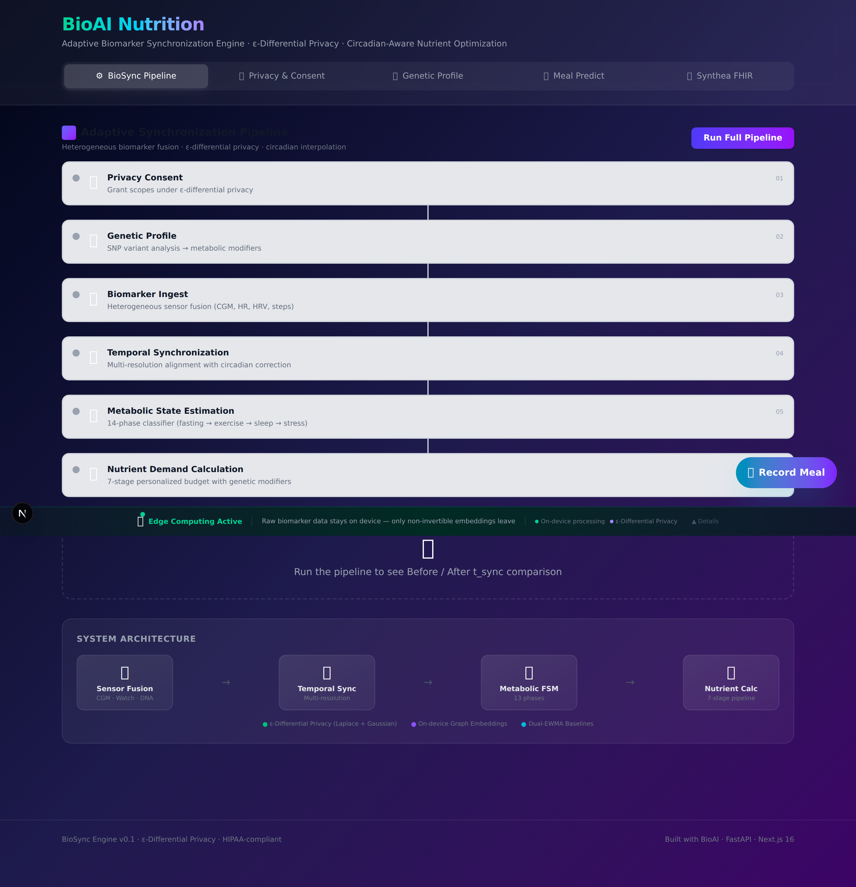
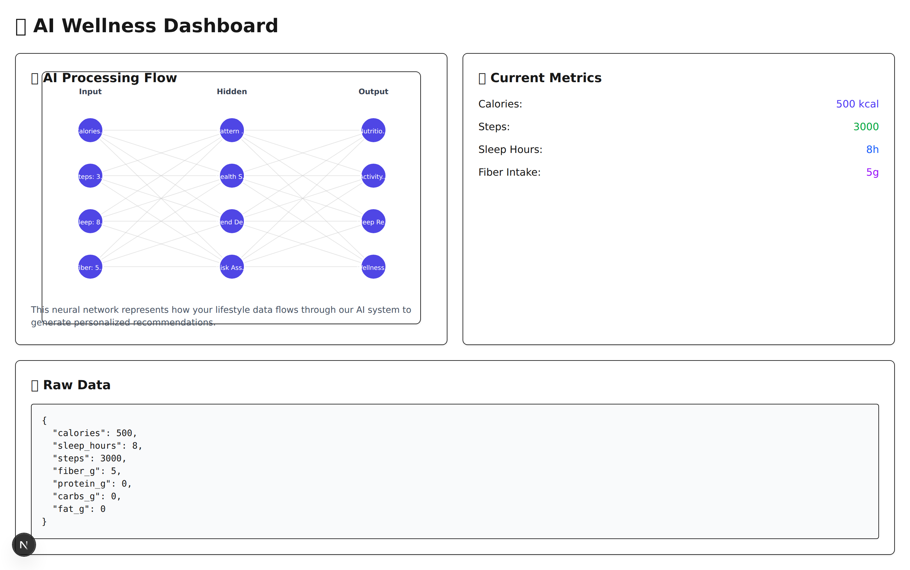

# Nutri-Node

[](https://www.python.org/)
[](https://nodejs.org/)
[](https://nextjs.org/)
[](https://fastapi.tiangolo.com/)

**AI-driven wellness platform** providing privacy-safe, personalized nutrition insights through a 7-stage biomarker processing pipeline.

Built with **FastAPI**, **Next.js 16**, **React 19**, and machine learning pipelines — featuring differential privacy, edge computing, and FHIR R4 interoperability.

---

## Quickstart

```bash
# Backend API
cd apps/api && pip install -r requirements.txt && uvicorn app.main:app --reload --port 8000

# Frontend Web
cd apps/web && pnpm install && pnpm dev
```

- FastAPI Docs → [http://localhost:8000/docs](http://localhost:8000/docs)
- Web App → [http://localhost:3000](http://localhost:3000)

---

## Demo

### 1. Nutri-Node Pipeline Console



The main interface provides a full-featured **7-stage biomarker processing pipeline** console with five interactive tabs:

| Tab | Features |
|-----|----------|
| **Pipeline** | Step-through execution of all pipeline stages — Privacy Consent → Genetic Profile → Biomarker Ingest → Temporal Synchronization → Metabolic State Estimation → Nutrient Demand Calculation |
| **Consent** | Granular consent management with ε-differential privacy scopes (glucose, heart rate, activity, sleep, genetic data) |
| **Genetic** | SNP variant analysis showing metabolic modifiers (MTHFR, FTO, APOE, TCF7L2, CYP1A2, etc.) |
| **Meal Predict** | Food recognition with real-time nutrient analysis and lag-compensated glucose response prediction |
| **Synthea** | FHIR R4-compliant synthetic patient data browser |

Additional features:
- **Lag Comparison View**: Side-by-side visualization of naive vs. lag-compensated temporal synchronization
- **Safety Override Notice**: Hierarchical conflict resolution alerts (genetic vs. medical safety)
- **Edge Boundary Bar**: Visual indicator of edge-cloud privacy boundary with real-time ε budget tracking

### 2. Interactive Dashboard & Neural Network Visualization



The `/dashboard` page features:

- **Neural Network Graph**: Animated D3.js force-directed graph visualizing how lifestyle data flows through the AI processing pipeline (inputs → pattern analysis → recommendations)
- **Real-time Metrics Cards**: Live display of calories, steps, sleep hours, and fiber intake from the API
- **Raw Data Inspector**: Full JSON view of current metrics data

### 3. Nutri-Node API Documentation


Full interactive API documentation at `/docs` with **28 endpoints** across 7 router groups:

| Group | Endpoints | Description |
|-------|-----------|-------------|
| **biomarker-engine** | `/engine/consent`, `/engine/genetic-profile`, `/engine/ingest`, `/engine/sync`, `/engine/metabolic-state`, `/engine/nutrient-budget`, `/engine/status`, `/engine/lag-comparison`, `/engine/edge-manifest`, `/engine/edge-process`, `/engine/medical-constraints` | Core biomarker pipeline |
| **events** | `/events/diet`, `/events/activity`, `/events/sleep`, `/events/{user_id}` | Lifestyle event logging |
| **recommendations** | `/recommendations/recommendations` | Rule-based personalized insights |
| **image-analyzer** | `/image-analyze/upload` | Food image AI analysis |
| **meal** | `/analyze-meal` | NLP-based meal nutrient analysis |
| **synthea** | `/synthea/status`, `/synthea/load`, `/synthea/patient/{id}`, `/synthea/reload` | FHIR R4 synthetic data |
| **metrics** | `/api/metrics` | Dashboard metrics feed |

### 4. API Status


### 5. Account & Privacy Settings


The `/account` page provides user-facing privacy controls — email preferences and notification consent management.

### Live API Examples

<details>
<summary><b>Meal Logging Request & Response</b></summary>

```bash
curl -X POST http://localhost:8000/analyze-meal \
  -H "Content-Type: application/json" \
  -H "X-API-Key: dev-api-key" \
  -d '{
    "user_id": "usr_12345",
    "food_items": [
      {"name": "Grilled Salmon", "quantity": 150, "unit": "g"},
      {"name": "Brown Rice", "quantity": 150, "unit": "g"},
      {"name": "Broccoli", "quantity": 100, "unit": "g"}
    ],
    "timestamp": "2026-03-04T12:30:00Z"
  }'
```

```json
{
  "event_id": "evt_2026_03_04_001",
  "event_type": "meal_logged",
  "timestamp": "2026-03-04T12:30:00Z",
  "user_id": "usr_12345",
  "meal_data": {
    "food_items": [
      {
        "name": "Grilled Salmon",
        "quantity": 150,
        "unit": "g",
        "confidence": 0.92,
        "nutrition": { "calories": 280, "protein_g": 25, "carbs_g": 0, "fat_g": 18, "fiber_g": 0 }
      },
      {
        "name": "Brown Rice",
        "quantity": 150,
        "unit": "g",
        "confidence": 0.88,
        "nutrition": { "calories": 120, "protein_g": 4, "carbs_g": 25, "fat_g": 1, "fiber_g": 2 }
      }
    ],
    "nutrition_total": { "calories": 450, "protein_g": 32, "carbs_g": 42, "fat_g": 15, "fiber_g": 4 }
  },
  "status": "success"
}
```

</details>

<details>
<summary><b>Recommendations Request & Response</b></summary>

```bash
curl -X POST http://localhost:8000/recommendations/recommendations \
  -H "Content-Type: application/json" \
  -H "X-API-Key: dev-api-key" \
  -d '{
    "user_id": "usr_12345",
    "daily_features": { "fiber_g": 18, "water_cups": 5, "sleep_hours": 6.5, "steps": 8234 },
    "user_targets": { "fiber_g": 25, "water_cups": 8, "sleep_hours": 8, "steps": 10000 }
  }'
```

```json
{
  "user_id": "usr_12345",
  "date": "2026-03-04",
  "recommendations": [
    {
      "id": "fiber_boost_simple",
      "priority": "high",
      "message": "Try increasing fiber intake by 6–8g/day: add an apple and a handful of almonds.",
      "rationale": "Your 7-day average fiber intake is 18g, below your target of 25g.",
      "action_items": ["Add 1 medium apple (4g fiber)", "Add 1 oz almonds (3.5g fiber)"],
      "guardrails": ["non-diagnostic", "food-allergy-aware"],
      "confidence_score": 0.89,
      "rule_id": "fiber_boost_simple"
    }
  ],
  "generated_at": "2026-03-04T08:00:00Z"
}
```

</details>

---

## Project Overview

**Nutri-Node** is a wellness assistant that analyzes lifestyle data — meal patterns, biomarkers, activity, and sleep — to generate personalized daily insights through a multi-stage biomarker processing pipeline.

It is **not a medical or diagnostic tool** — all recommendations are educational and intended to help users make sustainable, informed decisions.

**Core principles**
- **Privacy-first**: Triple-layer protection (edge computing + differential privacy + granular consent)
- **Explainable AI**: Transparent, rule-based recommendations with confidence scores
- **Modular architecture**: Independently testable pipeline stages with clear separation of concerns
- **Interoperable**: FHIR R4, LOINC, and HL7 standards support

---

## Biomarker Engine Pipeline

The core innovation — a **7-stage processing pipeline** with dynamic physiological lag compensation:

```
Stage 0: Consent Filter    → Granular privacy enforcement at algorithm level
Stage 1: Temporal Sync     → Dynamic lag model: t_sync = t_event + Δt_base × γ_genetic × φ_circadian
Stage 2: Normalization     → Genotype-aware Z-scores (personal → genetic → population cascade)
Stage 3: Interpolation     → Circadian + ultradian rhythm gap-filling
Stage 4: Metabolic State   → 14-phase composite classifier (dietary, exercise, sleep, stress)
Stage 5: Nutrient Calc     → Personalized budget with hierarchical conflict resolution
Stage 6: DP Noise          → Four-tier dynamic differential privacy (ε = 0.1 ~ 0.8)
```

**Key results**: +420% correlation improvement (Pearson r: 0.15 → 0.78), −82% peak timing error (45 min → 8 min MAE).

**Adaptive Self-Calibration** closes the feedback loop:

```
ε_k = t_peak_actual − t_peak_predicted
↓ decomposed into three channels:
  δ_base(b)   — per-biomarker additive correction
  δ_circ(h)   — per-hour circadian phase shift
  κ_genetic    — multiplicative genome factor correction
```

---

## Tech Stack

| Layer | Technologies |
|-------|---------------|
| Backend API | FastAPI · Python 3.12 · Pydantic v2 · SQLAlchemy · Alembic |
| Biomarker Engine | Temporal Sync · Self-Calibration · Circadian Interpolation · Metabolic State · Nutrient Calculator · 7-Stage Pipeline |
| Sensor Adapters | CGM Adapter · Activity Adapter · Sleep Adapter · Genetic Adapter · Location Adapter |
| Privacy Layer | Differential Privacy (4-tier ε-DP) · Edge Processor (64-dim embedding) · Dynamic Consent Manager · Health Graph Embedding |
| Frontend | Next.js 16 · React 19 · TypeScript · Tailwind CSS 4 · D3.js 7 · Recharts 3 |
| Infrastructure | Docker · Kubernetes · GitHub Codespaces · GitHub Actions |
| Data & Interoperability | Synthea (FHIR R4) · LOINC · HL7 |
| ML & Data | scikit-learn · XGBoost · Pandas · Polars |
| Pipeline Orchestration | Prefect · Great Expectations |

---

## Architecture

```
┌─────────────── Edge Device (User) ───────────────┐
│                                                   │
│  Sensors ─┬─ CGM Adapter (BLE, 5min)              │
│           ├─ Activity Adapter (HR, HRV, Steps)    │
│           ├─ Sleep Adapter                        │
│           ├─ Genetic Adapter (SNP, one-time)      │
│           └─ Location Adapter                     │
│                     ↓                             │
│  ┌─ 7-Stage Pipeline ──────────────────────────┐  │
│  │ S0: Consent Filter  → S1: Temporal Sync     │  │
│  │ S2: Normalization   → S3: Interpolation     │  │
│  │ S4: Metabolic State → S5: Nutrient Calc     │  │
│  │ S6: Differential Privacy                    │  │
│  └─────────────────────────────────────────────┘  │
│           │                                       │
│  Self-Calibration Feedback Loop                   │
│  (ε_k → δ_base, δ_circ, κ_genetic)               │
│           ↓ (64-dim embedding only)               │
├───────────── PRIVACY BOUNDARY ────────────────────┤
│                   ↓                               │
│  Server: FHIR R4 API → Recommendations → EHR      │
└───────────────────────────────────────────────────┘
```

---

## Project Structure

```
Nutri-Node/
├── apps/
│   ├── api/                          # FastAPI Backend
│   │   ├── app/
│   │   │   ├── biomarkers/           # Sensor adapters (CGM, Activity, Sleep, Genetic, Location)
│   │   │   ├── engine/               # Core pipeline modules
│   │   │   │   ├── pipeline.py       # 5-Stage orchestrator
│   │   │   │   ├── temporal_sync.py  # Physiological lag model
│   │   │   │   ├── normalization.py  # Genotype-aware Z-scores
│   │   │   │   ├── interpolation.py  # Circadian gap-filling
│   │   │   │   ├── metabolic_state.py # 14-phase classifier
│   │   │   │   ├── nutrient_calculator.py # Personalized budget
│   │   │   │   └── self_calibration.py    # Adaptive feedback loop
│   │   │   ├── privacy/              # Privacy modules
│   │   │   │   ├── consent_manager.py     # Dynamic consent (15 scopes)
│   │   │   │   ├── differential_privacy.py # 4-tier ε-DP engine
│   │   │   │   ├── edge_processor.py      # Edge-cloud boundary
│   │   │   │   └── graph_embedding.py     # Health graph embedding
│   │   │   ├── routers/              # API route handlers
│   │   │   ├── routes/               # Data ingestion routes
│   │   │   ├── schemas/              # Pydantic request/response models
│   │   │   └── services/             # Business logic (PII filter, etc.)
│   │   ├── alembic/                  # Database migrations
│   │   └── tests/                    # API test suite
│   └── web/                          # Next.js 16 Frontend
│       └── app/
│           ├── components/           # UI components
│           │   ├── PipelineVisualizer.tsx
│           │   ├── MealPredictionFlow.tsx
│           │   ├── MetabolicStateCard.tsx
│           │   ├── NutrientBudgetPanel.tsx
│           │   ├── PrivacyConsentPanel.tsx
│           │   ├── GeneticProfilePanel.tsx
│           │   ├── SyntheaExplorer.tsx
│           │   ├── LagComparisonView.tsx
│           │   ├── SafetyOverrideNotice.tsx
│           │   ├── EdgeBoundaryBar.tsx
│           │   └── NeuralNetworkGraph.tsx
│           ├── dashboard/            # AI Wellness Dashboard
│           └── account/              # Account & Privacy Settings
├── data-contracts/                   # SQL schema definitions
├── rules/                            # YAML recommendation rules
├── pipelines/                        # Data pipeline definitions
├── infra/
│   ├── docker/                       # Docker configurations
│   └── k8s/                          # Kubernetes manifests
├── docs/                             # ADRs, design docs, screenshots
└── scripts/                          # Automation & utility scripts
```

---

## Privacy & Ethics

- **Triple-layer privacy protection**: Edge computing + Dynamic differential privacy + Granular consent management
- **Four-tier ε allocation**: CRITICAL (ε=0.1, genetic), HIGH (ε=0.3, glucose), MEDIUM (ε=0.5, HR/sleep), LOW (ε=0.8, activity)
- **Raw data never leaves the device**: Only 64-dim embeddings and DP-noised stats cross the privacy boundary
- **15 granular consent scopes** with immediate revocation propagation
- All insights are educational and non-clinical — the platform is **not a medical device**
- GDPR Article 7 and HIPAA §164.508 compliance at the algorithmic level
- Privacy Exposure Index (PEI) tracking with 24-hour budget reset cycles
- PII filter applied to all server-side logging

---

## Example Recommendation Rule

```yaml
id: fiber_boost_simple
when:
  daily_features.fiber_g: "< user_targets.fiber_g * 0.8"
then:
  message: "Try increasing fiber intake by 6–8g/day: add an apple and a handful of almonds."
  rationale: "Your 7-day average fiber intake is below target."
  guardrails: ["vegan/food-allergy aware", "non-diagnostic"]
```

---

## Development Setup

### Prerequisites
- Python 3.12+
- Node.js 18+ (22 recommended)
- pnpm
- PostgreSQL (optional, for full setup)

### Option 1 – GitHub Codespaces (recommended)
Open this repository in [GitHub Codespaces](https://github.com/features/codespaces) to launch a preconfigured development environment.

### Option 2 – Local setup

1. **Clone the repository**
   ```bash
   git clone https://github.com/deokhwajeong/BioAI-Nutrition.git
   cd BioAI-Nutrition
   ```

2. **Backend (API) Setup**
   ```bash
   cd apps/api
   pip install -r requirements.txt
   uvicorn app.main:app --reload --host 0.0.0.0 --port 8000
   ```
   Access FastAPI docs at → [http://localhost:8000/docs](http://localhost:8000/docs)

3. **Frontend (Web) Setup**
   ```bash
   cd apps/web
   pnpm install
   pnpm dev
   ```
   Access the web app at → [http://localhost:3000](http://localhost:3000)

4. **Database Setup** (optional)
   - Install PostgreSQL
   - Run the schema: `psql -f data-contracts/schema.sql`

---

## Testing

```bash
# API tests
cd apps/api && pytest tests/

# Web tests
cd apps/web && pnpm test
```

---

## Roadmap

- [x] Repository and environment setup
- [x] FastAPI skeleton with API key security
- [x] Data contracts (Events, Features, Recommendations)
- [x] Rule engine MVP
- [x] Frontend integration (Next.js 16 + D3.js + Recharts)
- [x] Seven-stage biomarker processing pipeline
- [x] Dynamic physiological lag model (temporal synchronization)
- [x] Adaptive self-calibration feedback loop
- [x] Genetic profile SNP modifier system (8 genes, 22 modifiers)
- [x] Differential privacy with four-tier sensitivity classification
- [x] Edge-cloud privacy boundary architecture (64-dim embeddings)
- [x] Synthea FHIR R4 patient data integration
- [x] Hierarchical conflict resolution (genetic vs. medical safety)
- [x] Health graph embedding for privacy-preserving data sharing
- [ ] OhioT1DM real-world validation
- [ ] Closed user testing

---

## Contributing

We welcome contributions! Please follow these steps:

1. Fork the repository
2. Create a feature branch: `git checkout -b feature/your-feature`
3. Make your changes and add tests
4. Run tests: `pytest` or `pnpm test`
5. Commit your changes: `git commit -m 'Add some feature'`
6. Push to the branch: `git push origin feature/your-feature`
7. Open a Pull Request

For major changes, please open an issue first to discuss what you would like to change.

---

## About

Developed by **Deokhwa Jeong**,
Embedded & Software Engineer | Technical Project Manager | Bio-Engineering Professional.

Focused on bridging **AI, engineering, and human wellness** through responsible technology.


